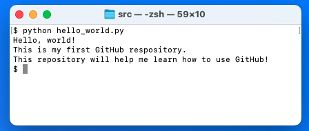
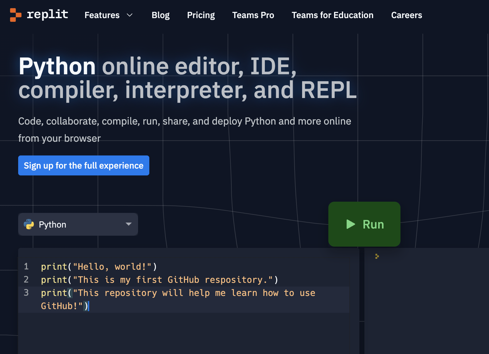
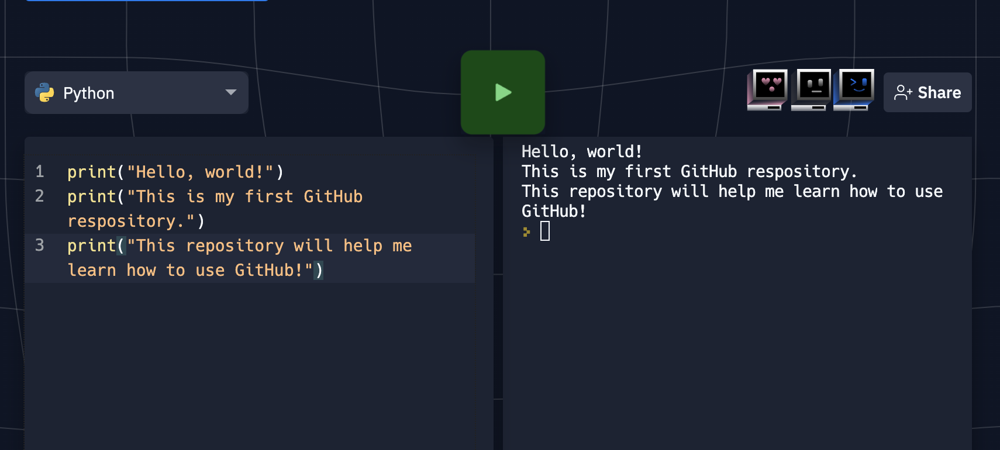

# Hello World: A Simple Python Program

## About Hello World

The "Hello World" program is a very simple Python program that prints the following:

> Hello, world!
>
> This is my first GitHub repository.
> 
> This repository will help me learn how to use GitHub!

## Requirements

In order to run the Hello World program on your computer from the [`hello_world.py` file](src/hello_world.py), you must:

* Have [Python](https://www.python.org/downloads/) installed, and
* Be able to access a command-line interface, such as Terminal for Mac or GitBash for Windows.

Alternatively, you may run the code in the file by using the Python online web editor [Replit](https://replit.com/languages/python3).

## Usage

**To run Hello World from the [`hello_world.py` file](src/hello_world.py):**

1. Open a command-line interface and navigate to the folder where `hello_world.py` is stored.
2. Type the following command: `python hello_world.py`
3. Press the "enter" key to see the following output:



**To run Hello World in a web browser:**

1. [Click this link](https://replit.com/languages/python3) to open Replit's Python editor in a web browser.
2. Copy the following code:
    ```python
    print("Hello, world!")
    print("This is my first GitHub respository.")
    print("This repository will help me learn how to use GitHub!")
    ```
3. Paste the code into Replit, as shown below:

    
4. Click the run button to display the following output:

    


